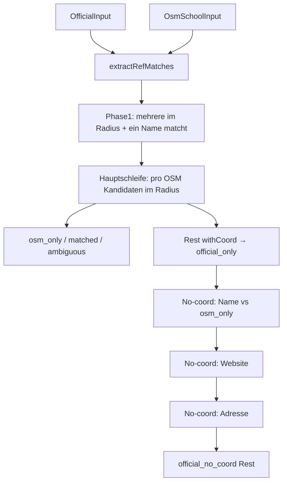

# `matchSchools` – Abgleich JedeSchule ↔ OSM

Implementierung: [`scripts/lib/match.ts`](../scripts/lib/match.ts), Funktion `matchSchools`.

**Eingaben:** `OfficialInput[]` (eine Bundesland-Slice), `OsmSchoolInput[]` (aus dem GeoJSON-Slice desselben Landes), `MatchSchoolsOptions` mit `osmStateByKey` (jedes OSM-Objekt → `StateCode`).

**Ausgabe:** `MatchRowOut[]` mit Kategorien u. a. `matched`, `official_only`, `osm_only`, `match_ambiguous`, `official_no_coord`.

Die Logik ist **bundesland-lokal**: z. B. `officialsNearOsm` berücksichtigt nur Amts-Schulen desselben Landes wie das OSM-Objekt (`MATCH_RADIUS_KM`).

## Ablauf (Mermaid)

Reihenfolge entspricht dem Code in `matchSchools` (nach `ref`-Pass und OSM-Restliste).

## Kurzbeschreibung der Phasen

1. **`extractRefMatches`**  
   Paart OSM-`ref` mit dem JedeSchule-ID-Suffix (gleiches Bundesland), wenn der Index eindeutig ist.

2. **Phase 1 (mehrere im Radius + Name)**  
   Globale Priorisierung nach Distanz: Wenn mehrere offizielle Punkte im Radius liegen und **genau einer** den normalisierten OSM-Namen trifft, wird dieser zuerst reserviert (`distance_and_name`).

3. **Hauptschleife restliche OSM**  
   Pro Kandidatenliste im Radius: 0 → `osm_only`, 1 → `matched` (distance), mehrere → Name oder `match_ambiguous`.

4. **`official_only`**  
   Noch nicht gematchte **with-coord**-Officials.

5. **No-coord-Fallbacks** (nur `withoutCoord`, jeweils land-lokal über `groupOfficialsByState` und genau **ein** passendes `osm_only` pro Schlüssel/Land):  
   normalisierter **Name** → **Website** → **Straßenadresse**; bei mehreren Treffern → `match_ambiguous` auf der OSM-Zeile.

6. **`official_no_coord`**  
   Verbleibende Officials ohne Koordination und ohne erfolgreichen Fallback.

Details zu Normalisierung: [`src/lib/compareMatchKeys.ts`](../src/lib/compareMatchKeys.ts), Radius: [`src/lib/matchRadius.ts`](../src/lib/matchRadius.ts).

Zur übergeordneten Pipeline: [pipeline.md](pipeline.md).
