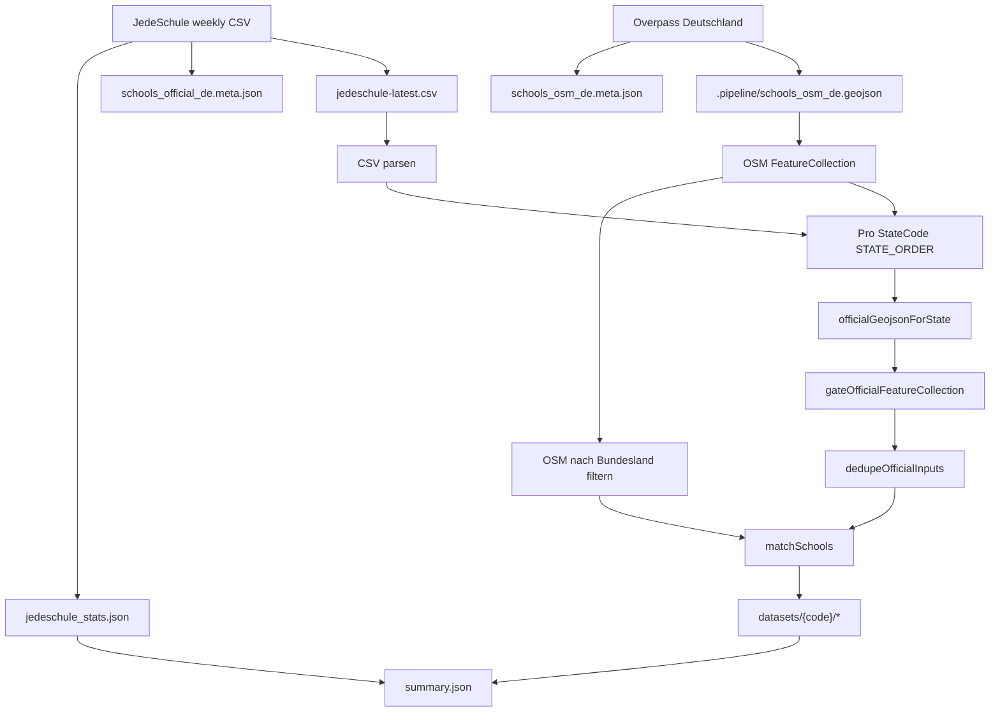

# Daten-Pipeline (Überblick)

Orchestrierung im Code: [`scripts/lib/nationalPipeline.ts`](../scripts/lib/nationalPipeline.ts), Pfade: [`scripts/lib/nationalDatasetPaths.ts`](../scripts/lib/nationalDatasetPaths.ts), CSV-Pfad: [`scripts/lib/jedeschuleDumpConfig.ts`](../scripts/lib/jedeschuleDumpConfig.ts).

Es gibt **keine** nationalen Zwischendateien mehr (`schools_official_de.geojson` / `schools_matches_de.json`). Der Abgleich läuft **pro Bundesland** in einem Durchgang.

## Ablauf (Mermaid)

## NPM/Bun-Skripte

| Skript                                    | Bedeutung                                                                                      |
| ----------------------------------------- | ---------------------------------------------------------------------------------------------- |
| `pipeline:download`                       | Beide Downloads parallel; Parent prüft Meta `ok`                                               |
| `pipeline:rebuild`                        | Nur `runStateFirstPipeline` (kein Netz)                                                        |
| `pipeline`                                | `download` → `rebuild`                                                                         |
| `pipeline:match` / `pipeline:split-lands` | jeweils ein vollständiger Lauf von `runStateFirstPipeline` (Alias; kein zweiter Split-Schritt) |

## Ausgaben

- **Pro Land:** `public/datasets/{code}/schools_official.geojson`, `schools_osm.geojson`, `schools_matches.json`, `schools_osm.meta.json`
- **Gesamt:** `public/datasets/summary.json` (`pipelineVersion`, `jedeschuleCsvSource: jedeschule-latest.csv`)
- **Intern (nicht im Pages-Build):** `public/datasets/.pipeline/schools_osm_de.geojson` (CI entfernt vor `vite build`)

Siehe auch: [matchSchools – Abgleichslogik](match-schools.md).
